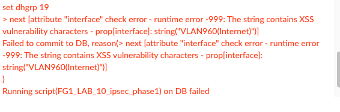

# FA-ZTP Change Log

[Back to README](README.md#table-of-contents)

# Releases

* [v0.5 - 4/27/21](#v05)
* [v0.4 - 4/26/21](#v04)
* [v0.3 - 4/22/21](#v03)
* [v0.2 - 4/21/21](#v02)
* [v0.1 - 4/20/21](#v01)

## v0.5

* Added IPv6 to BGP Network Advertisements.
* Added FortiLink Split Interface option.
* Added FortiLink IP Change w/ DHCP Scope Change.
* Improved the FortiLink interface logic by adding a field "FortiLink Interfaces From VSW" field.
  * This tells Ansible that the ports desired for FortiLink use are part of a default-factory virtual switch.
  * This is common on smaller FortiGates for branch offices w/out dedicated FortiLink ports.

## v0.4

* Added IPv6 Addresses on the Network Interfaces.
* Added validation with FortiAP Radio1/2 Channel Width/Bonding settings.
* Added Enterprise Radius FortiAP Authentication.
* Added basic Captive Portal for SSIDs.
* Added Radius Server.
* Added Radius Server User group.
* Changed the "Set Community" field to a parsed list under BGP Route Maps.
* Added additional fields to BGP Neighbors & Neighbor Groups:
  * Update Source
  * Graceful Restart
  * Soft Configuration
* Added AS Path Lists with Regex Expressions.
* Added Prefix Lists.
* Added IPSec Remote IP.
* Added IPSec Allow Access list.
* Added IPSec Bandwidth Limits.
* Added a third digit to the intrinsic sort order of the dvmdb Jinja2 scripts to allow for more customization.
  * This leaves plenty of out-of-box sort order ranges for use.

The Organizational Workflow Data Model has undergone significant changes as a result of the additions above.

[Click here to see the v0.4 Organizational Workflow Data Model](docs/images/spreadsheet_data_model_v0.4.png)

### Known Issues

* FortiManager does not allow parentheses in network interface names. It considers them a XSS character in the API.
  * You cannot use parentheses in the Network tab of the Organizational Workflow Data Model.
  * 
* There is an issue when trying to specify the FortiAP "Radio 1/2 Band" Settings.
  * This feature doesn't always work, and we think it is a bug within the FortiManager API. 
  * If the generated scripts are manually copied and pasted, they seem to work within a FortiGate v6.4.4 CLI.
  * If the 'FortiAP_Profiles' dvmdb script constant fails on the "band" value then just remove it and fix it later within
    FortiManager, for now.
* "Radio 1/2 Mode" is currently not implemented as an actual Jinja2 template item
  * The default is "Access Point" and the only other choice is "Monitor" -- we're leaving this for a later release.

## v0.3

* 4/22/21

* FortiGate HA was implemented. No group password option is included. 
  Please change it post-ZTP-operations or use the Ansible Vault.
  * A friendly reminder to never store passwords in this repo. Ever.
* Added **Validate_Input_ZTP_Data.yml** playbook that imports a spreadsheet, renders the FortiGates,
validates that data, and then generates the dvmdb jinja2 templates to ensure there are no issues.
  
### Bug Fixes

* Fixed an issue with the interface zones jinja2 script.
* Removed an un-used field 'Topology Type' from the FortiGates sheet/entity on the Organizational Workflow Data Model.
* Removed an un-used python script that was previously assigned to generating CIDR conventions.

## v0.2

* 4/21/21
* Bug Fixes and Workflow Changes.
* A new spreadsheet for an SDWAN Demo. 
  * Uses SDWAN Template Assignments to simplify the data in the spreadsheet.

### Bug Fixes

* Fixed an issue where if the **default_fmgr_target_adom** didn't match the ADOM on the FortiGate YAML Files,
  some objects would get created in the wrong ADOM. 
  * All ADOMs now flow downward from the **Organizational Workflow Data Model**
  * The **default_fmgr_target_adom**  setting in **roles/fortigate.ztp/defaults/main/fortimanager_settings.yml** 
    now has a very insignificant role. It may get deprecated soon.
* Fixed an issue with the 14_static_routes.j2 dvmdb_script template where empty fields were being set.
* Fixed an issue where empty jinja2 templates for dvmdb_scripts would be rendered and ran.
  * These were empty or had just a config clause with no data in them. 
  * Not harmful, but it was adding to execution times and increasing the number of scripts.

### Workflow Changes

* The "fortiswitches" and "fortiaps" sheets on the Organizational Data Model have been removed.
  * They are replaced with additional columns on the "DeviceLocations" sheet.
  * This changed the relationships slightly, and the changes have been reflected in the Organizational Workflow Data Model.
* Changed the fgt_lan_port and fgt_lan_ip on the FortiGates sheet to fgt_mgmt_port and fgt_mgmt_ip.
  * Normal LAN interfaces can still be configured via the Networks sheet with vlan of 0 and specifying a physical interface.
  * Changed jinja2 templates to reflect this.
  * Use this functionality for a MGMT Port. You can set a VRF.
  * Set any static routes it needs under the Static Routes sheet.
* Global Policy Packages has been removed from the workflow. Do these before-hand and assign to target ADOMs.
* Added the ability to assign Provisioning Templates and SDWAN Templates.

## v0.1

* 4/20/21
* First release.

### Known Issues

* FortiGate HA Config not implemented.
* Normal Interface zones not working via config file.
* At times, FortiManager reports a failed "push config" task when a FortiGate is added, but the config is still pushed.
  * Usually a config conflict that can be easily resolved after the task errors out.
* Some documentation tutorials are not yet complete. 
* We only have one example spreadsheet at the moment -- we expect this sample library to grow.
