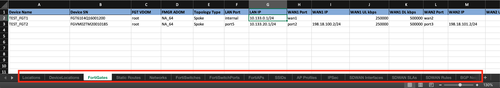
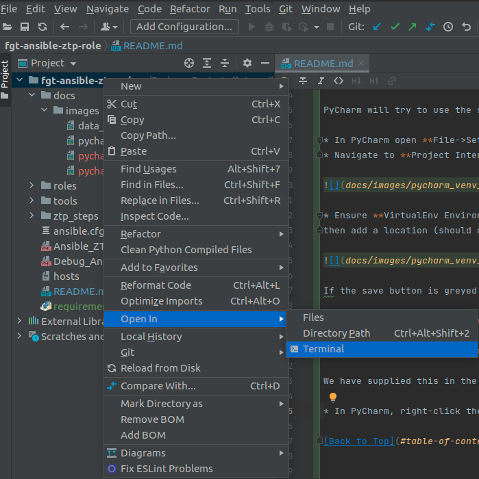

# FortiGate Ansible Zero-Touch-Provisioning (FA-ZTP)

## Table of Contents

* [License](LICENSE.md)
* [Change Log](CHANGELOG.md)
* [Contributing](CONTRIBUTING.md)
* [Introduction](#introduction)
* [Audience](#audience)
* [Concepts](#concepts)
* [Getting Started](#getting-started)
  * [Pre-Requisites](#pre-requisites)
  * [Workstation / Testing Environment](#workstation--testing-environment)
  * [Customizations / Forking this Repo](#customizations--forking-this-repo)
  * [Cloning the Forked Repo](#cloning-the-forked-repo)
  * [Python Virtual Environment](#python-virtual-environment)
  * [The Ansible "Hosts" File](#the-ansible-hosts-file)
  * [Verify FortiManager Ansible Connection](#verify-fortimanager-ansible-connection)
  * [Run the "All-in-One" Playbook](#run-the-all-in-one-playbook)
  * [Inspect FortiManager](#inspect-fortimanager)
* [Architecture](docs/architecture/ARCHITECTURE.md)
  * [Data Layers and Models Presentation](docs/architecture/ARCHITECTURE.md#data-layers-and-models-presentation)
  * [Organizational Workflow Data Model](docs/architecture/ARCHITECTURE.md#organizational-workflow-data-model)
  * [Ansible ZTP Role Data Model](docs/architecture/ARCHITECTURE.md#ansible-ztp-role-data-model)
  * [Ansible ZTP Role Structure](docs/architecture/ARCHITECTURE.md#ansible-ztp-role-structure)
  * [Ansible ZTP Role Steps](docs/architecture/ARCHITECTURE.md#ansible-ztp-role-steps)
* [Tutorials](docs/tutorials/TUTORIALS.md)
  * [Extending the Organizational Workflow Data Model](docs/tutorials/extending_organizational_workflow_data_model.md)
  * [Extending the Ansible ZTP Role Data Model](docs/tutorials/extending_ansible_ztp_role_data_model.md)
  * [Adding Tasks to the Ansible ZTP Role](docs/tutorials/add_ansible_role_task.md)
  * [Modifying the FortiGate CLI Jinja2 Templates](docs/tutorials/modifying_fortigate_config_templates.md)
  * [Debugging the Ansible ZTP Role](docs/tutorials/debugging_ansible_ztp_role.md)
  * [Customizing the FortiGate YAML Schema Validation](docs/tutorials/customizing_ansible_ztp_role_data_model_validation.md)
  * [Exporting Rendered FortiGate CLI Jinja2 Template Output to File for Manual Use](docs/tutorials/exporting_jinja2_dvmdb_scripts.md)
* [Reference](docs/reference/REFERENCE.md)
  * [Ansible ZTP Role Steps](docs/reference/ansible_ztp_role_steps.md)
* [Contributions](#contributions)

## Introduction

The FortiGate Ansible Zero-Touch-Provisioning (FA-ZTP) Role is a toolset for deploying FortiGates
through the FortiManager API. It is designed to help shape organizational workflows by providing 
pre-configured examples of each step in the process, but it is also a great learning tool
for Ansible and the FortiGate ZTP process.

Every step is clearly defined in the Ansible Role Tasks and supporting playbooks, and any step can be 
changed to meet organizational workflow needs. 

There are also data models to help explain the actual
FortiGate configuration data entities themselves, and how the Ansible role restructures this data to perform the ZTP operations.

It is not as fully-featured as some of Fortinet's other Professional Services Solutions (such as FortiProvision),
but it can help "bridge the gap" for organizations with the desire and resources to develop their own solutions.

It goes without saying that everything that this role does can be accomplished with the FortiManager GUI, however,
we have had overwhelming feedback from our customers who want to use Ansible.

[Back to Top](#table-of-contents)


## Audience

* Organizations that need to programmatically deploy many FortiGates/FortiSwitches/FortiAPs of any kind.
* MSPs who need to take configuration specifications from customers, for FortiGate deployments, using a formal data model. 
* Anyone who wants to learn FortiGate ZTP using the FortiManager **Model Device** method.
* Anyone who wants to learn more about how to use Ansible. 
* DevOps Engineers interested in developing an **Infrastructure-as-code** agile workflow for FortiGate deployments.
* Anyone who wants to take the code or principles contained in this solution and make a completely custom solution.

This is a **boilerplate** for internally-developed FortiGate ZTP projects.

## Concepts

**Zero-Touch Provisioning is a data problem that varies by Organization.**

The overall goal of this toolset is to help Fortinet customers take their **Organizational Workflow Data** and 
programmatically transform it into a set of instructions that Ansible can use to create FortiGates, within FortiManager, and then configure them as a result.

It accomplishes this using the **Model Device** option in FortiManager.

This means the FortiGates' configuration are defined before they **check in** to FortiManager.
This contrasts to solutions that wait for FortiGates to **check in** to FortiManager and *then* configures them.

The FortiGate Ansible ZTP Role uses Ansible tasks/defaults/variables as a **scaffold**, which use a lot of **Jinja2** templates, and a tiny bit
of **Python** to accomplish its goals. We have tried to use generic API calls and CLI scripts where possible to teach the FortiManager API and the FortiGate CLI.

The **Organizational Workflow Data** used by the Ansible ZTP Role to define FortiGates, is provided by XLSX spreadsheet.

While the spreadsheet format is a great learning tool to package with this solution, it is supported by
 a full Python SQLAlchemy data model which streamlines the development of custom data inputs. We also
 include generated UML diagrams to help explain relationships (as defined in the SQLAlchemy Python classes).

[Back to Top](#table-of-contents)

### Data Layers and Models

Here is a diagram of the layers involved:


The graphic above shows the layers involved, but we usually only work with the top two layers:


   

#### Organizational Workflow Data Layer & Model

* Defines locations, FortiGates/FortiSwitches/FortiAPs, IPs and routing, ipsec, sdwan, policies and more.
  * Mirrors FortiGate configuration data entities.
* Can be easily modified to include additional FortiGate configuration data entities and attributes.
* A Python script is included to convert spreadsheet files to the Ansible ZTP Role Data defined below.
    * Included SQLAlchemy Python classes for UML Diagram generation. 
      * Easily illustrates and tracks changes to the Organizational Workflow Data Model.
      * Also facilitates easy conversion from Spreadsheet->Python->AnsibleZTP workflow 
        to a WebsiteForm->Database->AnsibleZTP workflow.
        



[Back to Top](#table-of-contents)

#### Ansible ZTP Role Data Layer & Model

* Flattens/Groups **Organizational Workflow Data** by FortiGate, each into their own **YAML file**.
* A **list of dictionaries** is created within Ansible when the FortiGate YAML files are read, 
    with each FortiGate YAML file being the dictionaries in that list.
* Any changes to the defined **Organization Workflow Data Model** need corresponding Ansible Task files/changes. 


[Back to Top](#table-of-contents)

#### Converting Organizational Workflow Data -> Ansible ZTP Role Data

In this example we are using an XLSX file, and a Python script, to convert Organizational Workflow Data to Ansible ZTP Role Data.

The example spreadsheet includes many flat tables as **sheets** or **worksheets**. This is by design. The Python script consumes
each sheet as its own **table**. It then uses these **tables** to group the datasets using the relationships between the worksheets as foreign keys.

The result is a dataset grouped by FortiGate, with all other sheets as attributes. 


It is with these FortiGate YAML files that the Ansible ZTP Role will execute its tasks.

The Ansible Role has to actually *read* these files into a list of dictionaries, to emulate a state, before it can take action. More on that later.


[Back to Top](#table-of-contents)

## Getting Started

In this section we will show you what it takes to get started with this repository. We will execute the sample
**Organizational Workflow Data** included and watch these objects get created within FortiManager.

Please ensure that the target FortiManager is a **test instance** for your first run!

### Pre-Requisites

* A FortiManager instance (v6.4+ is preferred, v7.0 is not yet tested).
* At least one FortiGate (physical or VM, v6.4+ is preferred, v7.0 is not yet tested).
  * Used to verify FortiManager configs -- can easily wipe/reset to test.
  * FortiSwitches and FortiAPs are supported when attached to a FortiGate configuration.
  * Technically not required -- can debug configurations on FortiManager directly.
* An Ubuntu 18/20 LTS Desktop Workstation.
* Jetbrains PyCharm Community Edition 2021.1+

### Workstation / Testing Environment

* We *strongly* recommend using an IDE such as PyCharm to clone and use this repo. The community edition is enough.

* We *strongly* recommend Ubuntu 18 or 20 LTS Desktop. Windows 10 and MacOS X can work with this solution but
instructions to do so are not included.

Please create an Ubuntu Desktop VM and visit jetbrains.com to download PyCharm Community Edition to that VM and install it.

*While jedi-level Vim and CLI skills are appreciated, when learning this solution, it is best to use a GUI.*

Once mastered, this Ansible Role can be used on the CLI like any other.

[Back to Top](#table-of-contents)

### Customizations / Forking this Repo

If major changes to this solution are anticipated it is **strongly recommended** to **fork** this repository.

Contributions are covered below for interested parties. 
We generally only accept contributions that embrace the extensible nature of this project.

[Back to Top](#table-of-contents)

### Cloning the Forked Repo

The **forked** repository can be cloned directly with PyCharm when it is opened. 


[Back to Top](#table-of-contents)

### Python Virtual Environment

PyCharm will try to use the system Python environment by default. We don't want this. We want to use a virtual environment.

* In PyCharm open **File->Settings**
* Navigate to **Project Interpreter**, click the gear icon on the top right, and select **Add..**


* Ensure **VirtualEnv Environment** is selected from the list on the left, 
then add a location (should default to repo path on local workstation) and click **Ok**. 


If the save button is greyed out please check that the path being used isn't already populated with a virtual environment.

#### Installing Python-Required Packages

We now need to populate the new virtual environment with the Python packages required to run this role.

We have supplied this in the form of a requirements.txt file. This file can be inspected by double-clicking it
from the project navigation pane. 

* In PyCharm, right-click the top-level folder and select **Open In->Terminal**

  
  
  This will open a CLI terminal on the bottom pane of PyCharm. The name of the python virtual enviornment should prefix the 
  cursor like this (*venv_name*):
  
  
  
* Run the following commands:
  * **sudo apt update -y**
  * **sudo apt install gcc -y**
  * **sudo apt install python3-dev -y**
  * **python -m pip install -U pip**
  * **pip3 install wheel setuptools** 
  * **pip3 install -r requirements.txt**

Troubleshoot any errors. These steps should complete without issue.

Finally, test the Ansible installation by running **ansible --version**.


[Back to Top](#table-of-contents)

### The Ansible Hosts File

Because the **hosts** file for Ansible contains a login for FortiManager it has been added to .gitignore and excluded from this repo.

**DO NOT include the FortiManager Login in your repo!**

We need to point Ansible at your FortiManager instance. Preferably a test FortiManager instance is being used at first.

Within that FortiManager instance create a new administrator with rights to an Administrative Domain (ADOM) that will be used for testing.

There are two methods of creating a hosts file:

* Create a **hosts** file in the repo and allow the .gitignore to work, keeping the credentials on your workstation. (PLEASE double-check your repos after pushing!)
* Add the required information to the /etc/ansible/hosts file. Ensuring the login will never get to your repo.

Whichever method you choose, you need to use the following as the config:

```ini


[fortimanager]
fmg1 ansible_host=fmg.test.local ansible_user=ansible ansible_password=fortinet

[fortimanager:vars]
ansible_network_os=fortinet.fortimanager.fortimanager
ansible_httpapi_use_ssl=true
ansible_httpapi_validate_certs=false


```

Edit the **fmg1 ansible_host=** line with the IP/Hostname for FortiManager along with a user created with JSON RPC access and rights to the ADOM you want to use.

This is a required step to tell Ansible how to talk to FortiManager.


[Back to Top](#table-of-contents)

### Ansible Config File

We need to tell the ansible.cfg file where the host file created in the step above, is located. 

Open **ansible.cfg** and edit the **inventory** key to the appropriate path.


### Verify FortiManager Ansible Connection

Now that the Ansible **hosts** file has been configured we need to test it.

* In PyCharm, right-click the top-level folder and select **Open In->Terminal** (or use the one already open)

  

* Run the command **ansible-playbook Test_FortiManager_Connection.yml**


#### Checking FortiManager Credentials

If the playbook has an error double-check the IP/DNS name, and login, specified in the hosts file.
Also check the admin user in FortiManager and make sure JSON RPC is enabled. 
Reset the password if needed, and ensure the ADOM permissions for that user are correct.


[Back to Top](#table-of-contents)


### Run the "All-In-One" Playbook

*Do not continue until the step above has been successfully completed. See the two troubleshooting sections if needed.* 

We can finally run the **All-In-One** playbook. This playbook runs other playbooks in the **ztp_steps** folder, in a specific sequence.

We cover the **ztp_steps** folder more in the .

To see this file, and the sequence it uses to perform the ZTP operations, .

Run the command **ansible-playbook Ansible_ZTP_AIO.yml** and watch for any errors. 

When the playbook is finished we can then inspect the FortiManager devices and objects created.


[Back to Top](#table-of-contents)

### Inspect FortiManager

* Login to the test FortiManager GUI. 
* Navigate to the ADOM in use. 
* Click on Device Manager.
* Two FortiGates (TEST-FGT1 & TEST-FGT2) should be present.
* Double-Click TEST-FGT1 and inspect the interfaces.
* Navigate to FortiSwitch Manager and inspect the FortiSwitch attached to TEST-FGT1
* Navigate to the FortiAP Manager and inspect the FortiAP attached to TEST-FGT1
* Navigate to Policies & Objects and inspect the **Branch** Policy Package.
  * Click on Object Configurations
  * Inspect Normalized Interfaces, Firewall Addresses, and Firewall Services. Search for **Ansible** to more easily see the created objects.
    

Now that you've successfully completed the Getting Started tutorial you can move on to the Architecture and Tutorial sections to further understand 
how to customize this solution.


[Back to Top](#table-of-contents)


## Contributions


If you wish to contribute please contact us on Github. 

After you read this: [Contributing](CONTRIBUTING.md).

We generally only accept contributions that accept, and accelerate, the **boilerplate** concept presented here.


[Back to Top](#table-of-contents)


