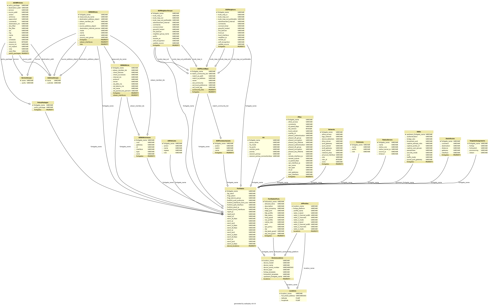
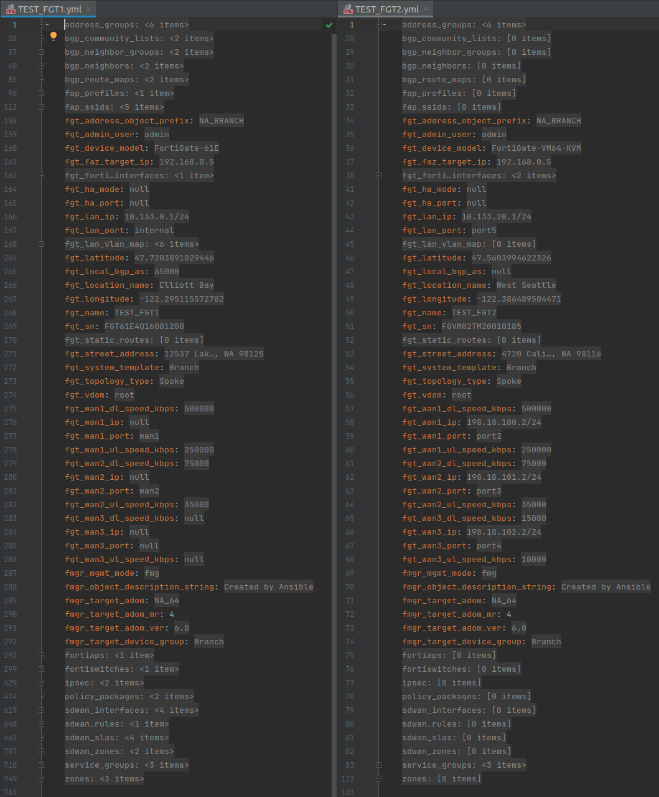

# FA-ZTP Architecture

[Back to README](../../README.md#table-of-contents)

* [Data Layers and Models Presentation](#data-layers-and-models-presentation)
* [Organizational Workflow Data Model](#organizational-workflow-data-model)
* [Ansible ZTP Role Data Model](#ansible-ztp-role-data-model)
* [Ansible ZTP Role Structure](#ansible-ztp-role-structure)
* [Ansible ZTP Role Steps](#ansible-ztp-role-steps)

## Data Layers and Models Presentation

Before you dive into this topic please review the PDF at **docs/powerpoint/Ansible ZTP Role Data Layers and Workflow.pdf**.

## Organizational Workflow Data Model

* [Understanding the Example Organizational Workflow Data Input Spreadsheet](organizational_workflow_data_model.md#understanding-the-example-organizational-workflow-data-input-spreadsheet)
  * [Relationships within the Spreadsheet](organizational_workflow_data_model.md#relationships-within-the-spreadsheet)
* [Understanding the SQLAlchemy Schema that defines the UML Diagram](organizational_workflow_data_model.md#understanding-the-sqlalchemy-schema)

## Ansible ZTP Role Data Model

* [Understanding the Ansible ZTP Role Data Model](ansible_ztp_role_data_model.md)

## Ansible ZTP Role Structure

* [Understanding the Ansible ZTP Role Architecture](ansible_ztp.md#understanding-the-ansible-ztp-role-architecture)
  * [Ansible Role Defaults](ansible_ztp.md#ansible-role-defaults)
  * [Ansible Role Variables](ansible_ztp.md#ansible-role-variables)
  * [Ansible Role Files](ansible_ztp.md#ansible-role-files) 
  * [Ansible Role Templates](ansible_ztp.md#ansible-role-templates) 
  * [Ansible Role Tasks](ansible_ztp.md#ansible-role-tasks)
* [Understanding the "ztp_steps" Ansible Playbooks](ztp_steps.md#understanding-the-ztp_steps-ansible-playbooks)

## Ansible ZTP Role Steps

* [Understanding the Ansible ZTP Role Steps](ztp_steps.md)