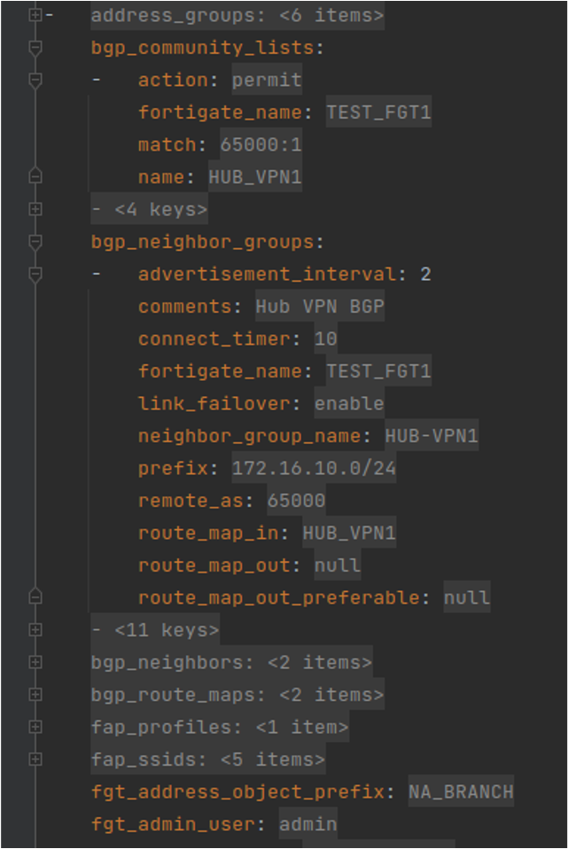
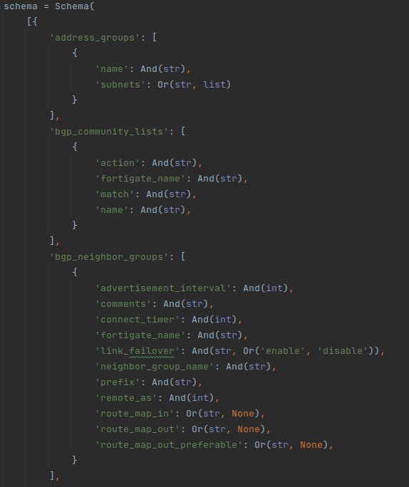

# FA-ZTP: Ansible ZTP Role Data Model 

[Back to README](../../README.md#table-of-contents)

[Back to Architecture](ARCHITECTURE.md)

* [Understanding the Ansible ZTP Role Data Model](#understanding-the-ansible-ztp-role-data-model)
* [Validating Imported Data and Rendered FortiGates](#validating-rendered-fortigates)

## Understanding the Ansible ZTP Role Data Model

The **Ansible ZTP Role Data Model** is the schema that this role uses to structure and validate imported data.

* We use the Python **Schema** package to accomplish this goal.
* We can validate input data types, the YAML structure, and even the values for the keys.
* This schema can be extended by adding columns or sheets to the input spreadsheet (or custom database query).
* This is the data schema that the included Jinja2 templates have all been coded to use.
* If this schema changes, so must the Jinja2 templates.
* Ansible Tasks in the ZTP Role also depend on this data model.

### Validating Rendered FortiGates

After importing FortiGate data from the spreadsheet we render those FortiGates to the location {{role_path}}/files/tmp/fortigates/.
The rendered FortiGate YAML files must adhere to the “Ansible ZTP Role Data Model”.

We use a  to compare the rendered FortiGate data against the defined schema.

* The task can be found at: **{{role_path}}/tasks/templates/validate_rendered_fortigates.yml**
* The Python script this task calls can be found at: **{{role_path}}/files/python/ansible_ztp_role_data_model/validate_rendered_fortigates.py**
* The actual schema definition is a separate Python file that the script imports: **{{role_path}}/files/python/ansible_ztp_role_data_model/fortigate_schema.py**
  * This file can be heavily modified to accommodate organization-specific workflows. It is shown below.
* This is the real value of this Ansible Role – we’ve done the data validation “legwork” that organizations can use to accelerate their own solutions.

