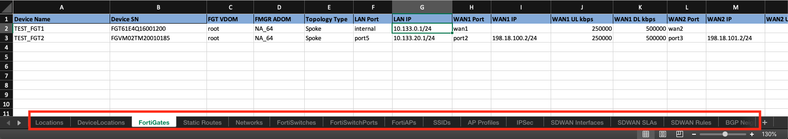
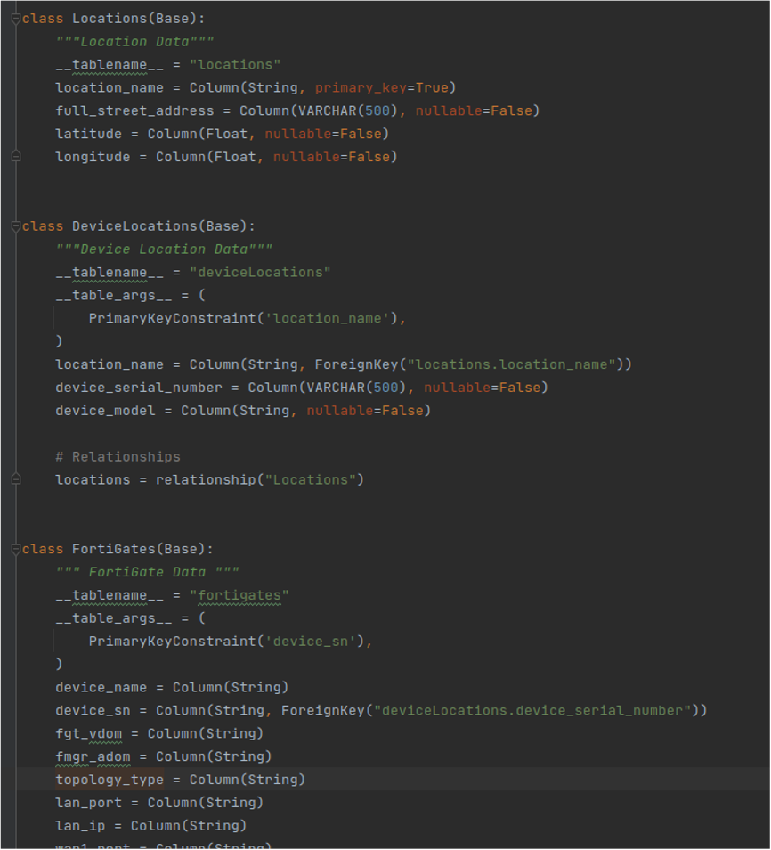

# FortiGate Ansible Zero-Touch-Provisioning (FA-ZTP)

[Back to README](../../README.md#table-of-contents)

[Back to Architecture](ARCHITECTURE.md)

## Understanding the Organizational Workflow Data

### Understanding the Example Organizational Workflow Data Input Spreadsheet

There is a sample spreadsheet under  that contains sample Organizational Workflow Data.

It contains two FortiGates, a physical FGT-61E and a KVM-based Fortigate, along with a FortiSwitch and FortiAP that is attached to the FGT-61E.

Out of the box this solution can import this spreadsheet to a test FortiManager for a simple demonstration.

### Relationships within the Spreadsheet

The spreadsheet acts as a relational database in Excel format. The relationships are shown by column names (typically "FortiGate Name" or "Upstream FortiGate Name").
For example, the **Device SN** column on the **FortiGates** tab matches the **Device Serial Number** column on the **DeviceLocations** tab.

The Python script that consumes this spreadsheet and converts it to the Ansible ZTP Role Data Model follows these relationships to group the data by FortiGate.

These relationships are also coded into a set of Python SQLAlchemy classes .

[Back to Top](#table-of-contents)

### Understanding the SQLAlchemy Schema

The SQLAlchemy schema defined under  has a few uses:

* It is used to generate a UML Diagram in PNG format. This helps illustrate the relationships in the spreadsheet.
* It can be used in Python to create a database to convert this role from spreadsheet input, to database input, for custom implementations.
* It can be used to help structure input data.

When the SQLAlchemy classes are modified a new UML diagram should be created by using the make_uml_diagram.py directory linked above. 

[Back to Top](#table-of-contents)