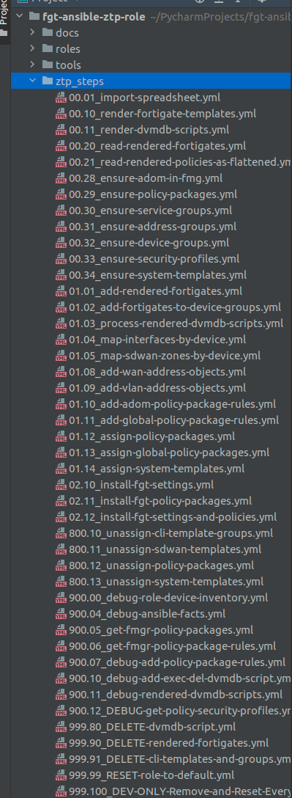

# FA-ZTP: Ansible ZTP Steps 

[Back to README](../../README.md#table-of-contents)

[Back to Architecture](ARCHITECTURE.md)

* [Understanding the "ZTP Steps" Ansible Playbooks](#understanding-the-ztp-steps-ansible-playbooks)
* [ZTP Steps Reference](#ztp-steps-reference)

## Understanding the "ZTP Steps" Ansible Playbooks

The Ansible playbooks at **/ztp_steps** constitute the sequence of events that need to occur for a successful FortiManager/FortiGate ZTP Deployment. 
These steps are fairly universal whether Ansible is utilized or not, and can be used to learn the overall FortiManager "Model Device" ZTP process.

The **/ztp_steps** folder is a collection of playbooks that stand outside of the actual Ansible ZTP Role. They "stand outside" because they reference the role
and specific tasks within the role itself, but can be executed on their own. 

The **/ztp_steps** playbooks also do data gathering, like reading the list of FortiGate YAML files, before actually executing. This is how we build a "state" layer into Ansible Roles.

The **/ztp_steps** playbooks have a sort order in the format of the decimal system to illustrate a clear order of operations.

These playbooks are responsible for importing data, rendering templates, running API calls, processing templated config scripts, and more.

## ZTP Steps Reference

We cover each of these steps in detail in the "reference" section of these readme files.

* [Ansible ZTP Role Reference](../reference/REFERENCE.md)

[Back to Top](#table-of-contents)